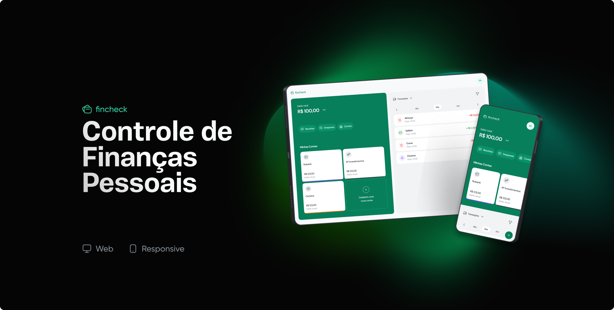

<div align="center">
  
</div>

<hr>
<br>



# Funcionalidades
- Cadastro, autenticação e recuperação de senha de usuários
- Listagem, cadastro, atualização e remoção de contas bancárias
- Listagem, cadastro, atualização e remoção de transações (receitas e despesas)

# Tecnologias utilizadas

## Front-end
- React.js
- Typescript
- Tailwind CSS
- Radix UI
- Headless UI
- React Query
- Axios

## Back-end
- NestJS
- Prisma
- PostgreSQL
- API REST

# Como executar
Antes de tudo, na sua máquina deverá ter:
- Node.js
- Docker
- Git

Será necessário instalar as dependências do projeto back-end que está no diretório `/api`, executá-lo, e então depois instalar e executar as dependências do front-end que se encontra no diretório `/frontend`.

## Executando o back-end
```bash
$ git clone https://github.com/danielfilh0/fincheck.git

$ cd fincheck/api

$ docker compose up -d
```
Aqui será preciso criar um arquivo `.env` seguindo o exemplo do arquivo `.env.example`.

Para o envio de emails, o sistema utiliza o serviço do `Gmail`. Será preciso criar uma conta `Google`, habilitar a autenticação
de dois fatores e criar uma senha de aplicativo neste <a href="https://myaccount.google.com/apppasswords">link</a>. Após isso,
no arquivo `.env` atribua às variáveis `EMAIL_USER` e `EMAIL_PASSWORD` o email e senha de aplicativo criados.

```bash
$ npx prisma migrate dev

$ npm install # ou yarn install

$ npm run start:dev # ou yarn start:dev
```
## Executando o front-end
```bash
$ cd fincheck/frontend

$ npm install # ou yarn install

```

Aqui será preciso criar um arquivo `.env` seguindo o exemplo do arquivo `.env.example`.

```bash
$ npm run dev # ou yarn dev
```

